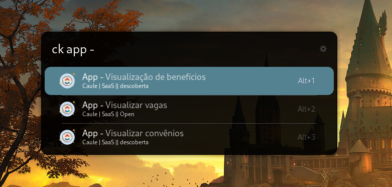

# UClickUp Tasks Extension
this extension is a simple extension that allows you to search for tasks in ClickUp and open them in your browser.



## Features
- Search for tasks in ClickUp
- Open tasks in your browser


## Requirements
- install requests to make requests to the ClickUp API
```bash
    pip install requests
```

- You need to have a ClickUp account
- You need to have a ClickUp Token API
- You need to have a Team ID


## Installation
1. After you have installed Ulauncher, go to preferences window > extensions > add extension and paste the following url: 
```shell
    https:://
```
2. Enter your ClickUp Token API
3. Enter your Team ID
4. Save the settings
5. Use the keyword "ck" to start searching for tasks